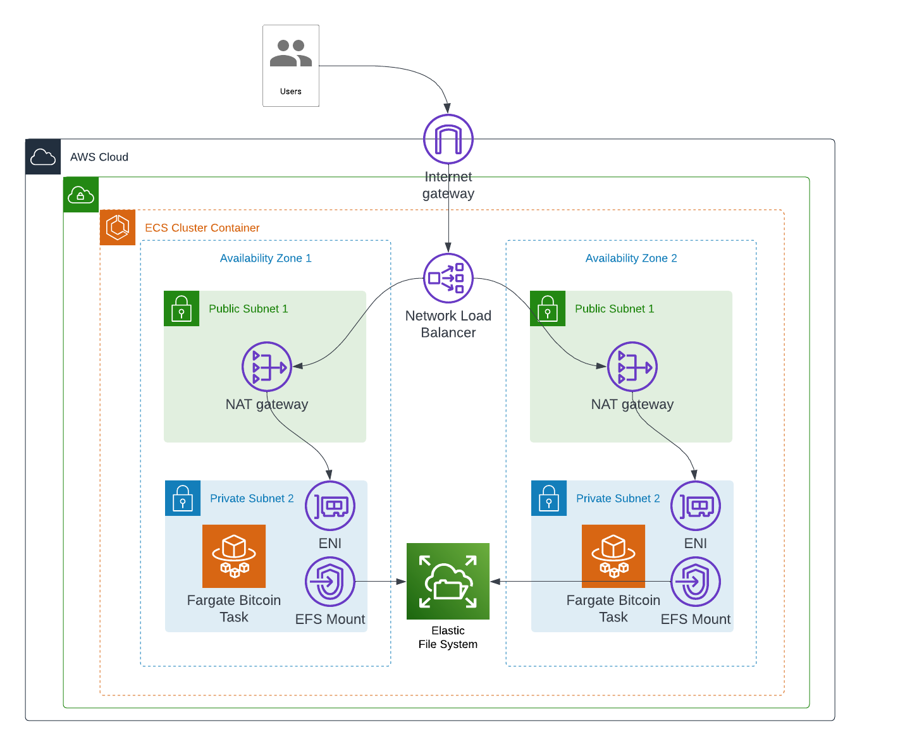

# Bitcoin Terraform Architecture

This terraform module deploys a bitcoin service using [AWS Fargate](https://aws.amazon.com/fargate/).
- There is a single VPC with four subnets: two private, two public. 
- There is a single Fargate task running the bitcoin dockerr image that can be placed in either _private_ subnet. In the future we can scale to more tasks as need-be. 
- There is an _Elastic Network Interface (ENI)_ in each private subnet connecting to a _NAT Gateway_ in each public subnet.
- The cluster makes use of an _Elastic File System (EFS)_ for persistence.
- The cluster is exposed to the internet via an _Application Load Balancer (ALB)_.

